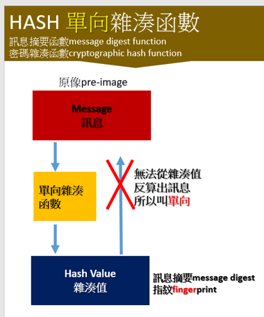
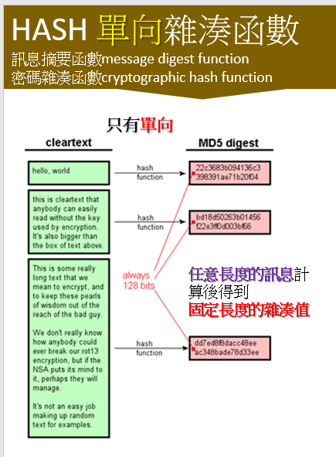

#
## HASH基本觀念

- HASH雜湊函式與雜湊值(hash value)

- 任意長度的訊息計算後得到 固定長度的雜湊值
  - md5是128 bits
  - sha1是160 bits

- [資料來源](http://www.unixwiz.net/techtips/iguide-crypto-hashes.html)

## HASH演算法
- [md5(MD5 message-digest algorithm)](https://en.wikipedia.org/wiki/MD5)
  -  MD5 was designed by Ronald Rivest in 1991 to replace an earlier hash function MD4
  -  MD5 was specified in 1992 as RFC 1321.

## HASH計算
- [使用Linux指令計算HASH](#Linux指令)
- [使用Python模組計算Hash](https://github.com/MyDearGreatTeacher/2021_2_courses/blob/main/CTF%E6%90%B6%E6%97%97%E5%A4%A7%E8%B3%BD/%E7%8F%BE%E4%BB%A3%E5%AF%86%E7%A2%BC%E4%B9%8B%E7%A0%B4%E5%AF%86%E5%88%86%E6%9E%90/Hash/2_2_%E4%BD%BF%E7%94%A8Python%E6%A8%A1%E7%B5%84%E8%A8%88%E7%AE%97Hash.md)
- [使用openssl模組計算Hash]

## 攻擊HASH
- Collision attack
- 長度擴充攻擊 (LEA Attack)Length extension attack 

