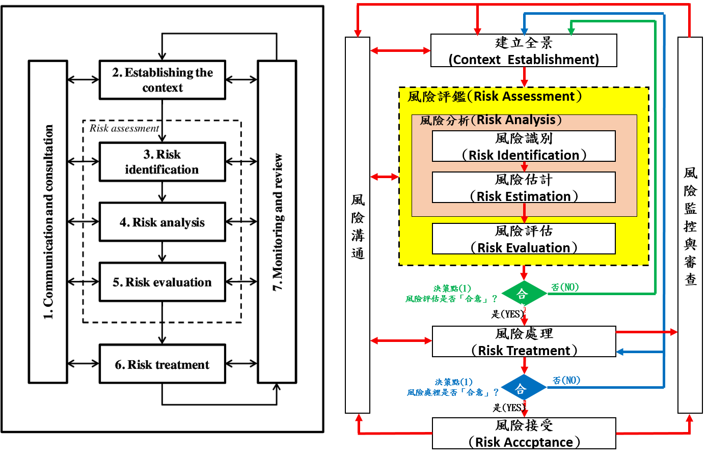

# 2-2.風險評鑑與風險處理

### [NIST RMF(Risk Management Framework)](https://en.wikipedia.org/wiki/Risk_Management_Framework)
- [NIST Special Publication 800-37, Revision 2, Risk Management Framework for Information Systems and Organizations: A System Life Cycle Approach for Security and Privacy](https://nvlpubs.nist.gov/nistpubs/SpecialPublications/NIST.SP.800-37r2.pdf)
  - This publication describes the Risk Management Framework (RMF) and provides guidelines for applying the RMF to information systems and organizations. 
  - The RMF provides a disciplined, structured, and flexible process for managing security and privacy risk that includes information security categorization; 
    - control selection, implementation, and assessment; system and common control authorizations; and continuous monitoring. 
  - The RMF includes activities to prepare organizations to execute the framework at appropriate risk management levels. 
  - The RMF also promotes near real-time risk management and ongoing information system and common control authorization through the implementation of continuous monitoring processes; 
    - provides senior leaders and executives with the necessary information to make efficient, cost-effective, risk management decisions about the systems supporting their missions and business functions; 
    - and incorporates security and privacy into the system development life cycle. 
  - Executing the RMF tasks links essential risk management processes at the system level to risk management processes at the organization level. 
  - In addition, it establishes responsibility and accountability for the controls implemented within an organization’s information systems and inherited by those systems. 

- [NIST Special Publication 800-53A(Revision 4)|Assessing Security and Privacy Controls in Federal Information Systems and Organizations--Building Effective Assessment Plans](https://nvlpubs.nist.gov/nistpubs/SpecialPublications/NIST.SP.800-53Ar4.pdf)
- [Risk Management Framework (RMF): An Overview](https://www.varonis.com/blog/risk-management-framework/)

### CNS/ISO 27005(2018)
- [ISO 27005]()  [[ISO/IEC 27005白皮书]](http://www.gxaqhbzx.com/news/shownews.php?id=37)
  - 目前有四份國際標準(ISO27001、ISO20000、BS25999及BS10012)的核心要求均需要建立與執行風險管理機制
  - 然而對企業而言還是不夠，例如ISO27001對風險評鑑僅有提供原則性的要求內容(what)，卻沒有提供實務性的指南內容(How to do)
  - 國際標準ISO27005正好可以提供技術性的支援，為組織的資訊安全風險管理提供實務上的執行指南(Guideline)。
  - ISO27005標準整合了四個管理系統對風險評鑑的要求，因此以ISO27005（Information Technology–Security Techniques – Information Security Risk Management，資訊技術–安全技術–資訊安全風險管理）的實作指引或要求，來作為設計與輔導基礎的實務訓練課程，將是最能滿足各單位需求的訓練方案。 
- [](https://wenku.baidu.com/view/fe4c3a1f59eef8c75fbfb337)
- [CNS 27005：資訊技術－安全技術－資訊安全風險管理](https://zh.wikipedia.org/wiki/%E9%A3%8E%E9%99%A9%E7%AE%A1%E7%90%86)
- [CNS 27005：資訊技術－安全技術－資訊安全風險管理(文章標題)](CNS27005.png)
- [ISO27005資安與個資風險管理認證班(資展國際)](https://www.iiiedu.org.tw/iso27005/)


### ISO 31000國際標準 ISO 31000 "Risk management – Principles and guidelines on implementation
- ISO 31000 is a family of standards relating to risk management codified by the International Organization for Standardization. 
- ISO 31000:2018 provides principles and generic guidelines on managing risks faced by organizations .

- Published standards:
  - ISO 31000:2018 - Risk management - Guidelines
  - ISO/TR 31004:2013 - Risk management - Guidance for the implementation of ISO 31000
  - IEC 31010:2019 - Risk management - Risk assessment techniques
  - ISO 31022:2020 - Risk management - Guidelines for the management of legal risk
  - IWA 31:2020 - Risk management - Guidelines on using ISO 31000 in management systems

- Standards under development:
  - ISO/AWI 31073 - Risk management - Vocabulary
  - ISO/CD 31030 - Risk management - Managing travel risks - Guidance for organizations
  - ISO/WD 31050 - Guidance for managing emerging risks to enhance resilience
  - ISO/CD 31070 - Risk management - Guidelines on core concepts

- [the process of risk management](https://en.wikipedia.org/wiki/Risk_management) consists of several steps as follows:
```
Establishing the context
Identification
Assessment
Risk options
Potential risk treatments
Risk management plan
Implementation
Review and evaluation of the plan
```
- [ISO31000：2018 條文及實務解說課程](http://www.asia-learning.com/course/itemlist/100156)

### 
- [CORAS - A Framework for Risk Analysis of Security Critical Systems]()

## [風險管理(risk management) Wiki說明](https://zh.wikipedia.org/wiki/%E9%A3%8E%E9%99%A9%E7%AE%A1%E7%90%86)

- 風險管理是一個管理過程，包括對風險的定義、測量、評估和發展因應風險的策略。
- 目的是將可避免的風險、成本及損失極小化。
- 理想的風險管理，事先已排定優先次序，可以優先處理引發最大損失及發生機率最高的事件，其次再處理風險相對較低的事件。

## 風險管理流程(Process)
- 單位內部資安管理人員應了解風險評鑑的技術，用來評鑑機關內資通系統的風險，以利於採取適當的安全防護控制措施，降低機關資安風險



- 1.全景建立
  - 在進行風險評鑑與實作資通安全各項防護控制措施之前，單位應該先行識別單位內、外各方面的安全需求，包含資通安全政策以及法令、法規、規章與合約，
  - 同時規劃與定義「風險評估準則」、「衝擊準則」及「風險接受準則」等風險管理基本準則。
    - 風險評估準則(Risk Evaluation Criteria)
      - 主要目的: 在決定風險處理之先後順序，
      - 單位應發展風險評估準則，並納入以下之考量因素，以評估資安風險
        - 考量因素
          - 是否執行風險評鑑與建立風險處理計畫
          - 是否執行控制措施實作
     - 衝擊準則(Impact Criteria)
       - 主要訂定當威脅與弱點結合，破壞資訊及資通系統資產的機密性、完整性及可用性
       - 對組織衝擊的嚴重性，可能包含營運受損、信譽損害、資安危害、業務與財務價值損失及違法情形等
       - 建議將衝擊嚴重性，以機密性、完整性及可用性遭破壞的程度，分為普、中、高3等級，
     - 風險接受準則(Risk Acceptance Criteria)
       - 決定風險處理範圍
       - 單位會因所負責任務的類別與性質、服務對象、內部資源及經費預算等因素，影響風險處理範圍
       - 在有限資源下，決定哪些風險影響層面較大，需優先進行處理，哪些風險影響層面較小，在資源不足情況下，暫時予以接受而保留風險

  - 實作風險評鑑之前，單位也應該先將風險評鑑範圍界定出來，並組成資通系統風險評鑑組織，助於執行與落實風險評鑑的成效
  - [主要工作1] 

- 2.風險評鑑(Risk assessment)
  - 本階段是「識別資訊資產、威脅、弱點、衝擊、可能性、已部署的控制措施」、「計算出風險大小」、「排出風險處理的優先序」及「確認可接受風險」的步驟，
  - 為確保在進行風險評鑑時的客觀性，必須以建立全景階段時所定義的「風險評估準則」、「衝擊準則」及「風險接受準則」為依據。
  - 風險評鑑的方法可區分為「高階風險評鑑」與「詳細風險評鑑」作法
    - 高階風險評鑑
    - 詳細風險評鑑

- 3,風險處理(Risk treatment)
  - 依據風險評鑑的結果與風險處理的優先順序，規劃風險處理計畫，部署安全控制措施以降低現有風險，並評估殘餘風險
  - 剩餘風險==>經過風險降低、風險轉移、風險避免及風險保留，4種風險處理策略後，所剩下來的風險，即為剩餘風險
    - 在執行風險處理過程，會選擇風險處理措施者，皆為不可接受風險，因此可接受風險也是一種剩餘風險
    - 風險是預估出來的，仍有不少風險是在評估中被忽略，沒有評估到的風險，也是一種剩餘風險
    - 剩餘風險必須要定期檢視，用來評估風險是否有變化，或有新技術與能力，可以管控剩餘風險，避免不會因為疏忽而提高風險
  - 四種風險處理{策略|模式}:
    - 1.Risk reduction = 風險降低(風險修改)
      - 藉由施行、移除或改變安全控制措施，修訂或降低風險等級，使殘餘風險被重新評定為可接受
      - 控制措施可提供多種形式保護，包含：矯正、消弭、預防、衝擊最小化、制止、偵測、復原、監視及認知
      - 於控制措施選擇期間，應權衡控制措施實作及維護之成本，與受保護的資產價值加以比較
    - 2.Risk retention = 風險保留(風險接受)
      - 接受他==> 接受對來自特定風險的損失負擔
      - 使用時機
        - 風險降低、風險轉移及風險避免3種策略，都沒辦法有效處理風險時，提出這3種措施無法執行的有效證明，因此只好選擇接受此風險
        - 執行完風險降低、風險轉移或風險避免其中一種策略，風險雖然改變，但仍有剩餘風險
        - 雖然可以使用風險降低、風險轉移、風險避免3種策略，但考量人力、成本及資源不足狀況下，也會使用風險保留

    - 3.Risk avoidance = 風險避免
      - 消極躲避風險。對風險情況不涉入或採撤退行動的決策
      - 對威脅發生狀況，選擇安控措施，避免風險發生
      - 範例 1:避免火災可將房屋出售，避免航空事故可改用陸路運輸酒後駕車可能造成極大後果，故宣導：開車不喝酒、喝酒不開車，便是風險避免最佳實例 
      - 範例 2:一群同仁到外地出差時，分別搭乘不同的交通工具或不同時段出發，避免全部遇到同樣風險的情形
      - 存在以下問題，所以一般不採用。
        - 可能會帶來另外的風險。比如航空運輸改用陸路運輸，雖然避免了航空事故，但是卻面臨著陸路運輸工具事故的風險。
        - 會影響企業經營目標的實現。比如為避免生產事故而停止生產，則企業的收益目標無法實現。
        
    - 4.Risk sharing = 風險分擔(風險轉移)
      - 根據風險評估結果，將部分風險分擔至能有效管理特定風險的另一方
      - 當風險發生時，將損失由其他組織或單位負擔，或將本身不足部分，委外給專業人員處理
      - 採用方式: 保險(用在硬體資產上較容易)|外包(Outsourcing)--合約中增訂懲罰性違約金條款
      - 範例 1:火災保險，當火災發生後，可由保險公司理賠方式，讓組織能夠繼續運作，這種風險轉移，沒有辦法降低風險發生機率，只是減少風險發生後的損失，以期組織可以繼續營運
      - 範例 2:外包(Outsourcing):當管理人員本身缺少管理伺服器的技術能力，只好將此外包給專業技術人員，由專業技術人員進行管理
        - 當管理上出現問題，也會向委外廠商求償。
        - 這種外包風險轉移方式，通常會引發其他風險，例如：委外廠商惡意行為、委外管理方式及委外廠商能力問題等，都是在風險轉移給外包商後產生
      

- 4.風險接受(Risk acceptance)
  - 針對機關權責主管決策接受的風險處置計畫與殘留風險評估，且留下明確的紀錄

- 風險溝通及諮詢
  - 在風險管理各階段的活動過程，單位資通安全風險管理組織、相關部門及權責主管應充分溝通，了解風險狀況交換彼此的意見與看法，討論出符合機關的建議與作為

- 風險監視與審查
  - 單位資安風險是動態的概念，會隨著外在環境變遷而更動，當增加新資產時必須納入風險管理控制範圍，且有必要定期修正現有資產的價值，新發現的弱點也會引起新的威脅與風險。
  - 因此風險必須被定期監控與審查

```
以下參考CNS 27005風險管理過程，以循環作法進行風險評鑑
首先建立全景，然後進行風險評鑑
若能提供充分資訊，有效地修正風險，至可接受等級，則評鑑工作完成，隨後展開風險處理
若資訊不充分，則需進行再一次修訂全景(例如：風險評估準則、風險接受準則或衝擊準則)之風險評鑑循環
此循環可能僅及於整體範圍之有限部分「風險決策點 1」
風險處理有效性，依風險評鑑結果而定，可能無法立即將剩餘風險降至可接受等級，若有需要，可變更全景參數(例如：風險評鑑、風險接受或衝擊準則)後，進行另一次風險評鑑循環，再執行更進一步風險處理「風險決策點 2」
```


