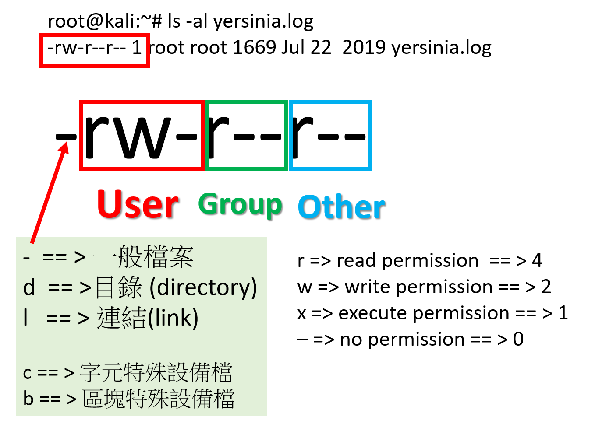

# permission權限

- [參考資料](File Permissions in Linux/Unix: How to Read/Write & Change?)

- ls -al /etc

```
drwxr-xr-x 188 root     root      12288 Oct  6 08:05 .
drwxr-xr-x  20 root     root      36864 Oct  6 07:23 ..
-rw-r--r--   1 root     root       2981 May  8  2019 adduser.conf
-rw-r--r--   1 root     root         44 May 17  2019 adjtime
-rw-r--r--   1 root     root        185 May  8  2019 aliases
drwxr-xr-x   3 root     root       4096 May 17  2019 alsa
drwxr-xr-x   2 root     root      20480 May 17  2019 alternatives


lrwxrwxrwx   1 root     root         30 May 17  2019 localtime -> /usr/share/zoneinfo/US/Eastern
....
```
## lrwxrwxrwx 各欄位說明


```
- == > 一般檔案
d == >目錄 (directory)
l == > 連結(link)

c == > 字元特殊設備檔
b == > 區塊特殊設備檔
```

```
r => read permission  == > 4 
w => write permission == > 2
x => execute permission == > 1
– => no permission == > 0
```

## 改變權限(Change access permissions) chmod 
```
chmod --help
Usage: chmod [OPTION]... MODE[,MODE]... FILE...
  or:  chmod [OPTION]... OCTAL-MODE FILE...
  or:  chmod [OPTION]... --reference=RFILE FILE...
Change the mode of each FILE to MODE.
With --reference, change the mode of each FILE to that of RFILE.

  -c, --changes          like verbose but report only when a change is made
  -f, --silent, --quiet  suppress most error messages
  -v, --verbose          output a diagnostic for every file processed
      --no-preserve-root  do not treat '/' specially (the default)
      --preserve-root    fail to operate recursively on '/'
      --reference=RFILE  use RFILE's mode instead of MODE values
  -R, --recursive        change files and directories recursively
      --help     display this help and exit
      --version  output version information and exit

Each MODE is of the form '[ugoa]*([-+=]([rwxXst]*|[ugo]))+|[-+=][0-7]+'.

GNU coreutils online help: <https://www.gnu.org/software/coreutils/>
Full documentation at: <https://www.gnu.org/software/coreutils/chmod>
or available locally via: info '(coreutils) chmod invocation'
```

### 使用root開發底下c程式

hello.c
```c
# include <stdio.h>

int main(){
  printf("Hello KSU \n");
  return 0;

}
```

```c
gedit hello.c
gcc hello.c -o hello
```
```
file hello

hello: ELF 64-bit LSB pie executable, x86-64, version 1 (SYSV), dynamically linked, interpreter /lib64/ld-linux-x86-64.so.2, for GNU/Linux 3.2.0, BuildID[sha1]=30e2657a383d9584a3eeeda1712e0e7441d5b35c, not stripped
```

## 原始狀態
```
root@kali:~# ls -al hello
-rwxr-xr-x 1 root root 16608 Oct  6 08:28 hello
```
```
su ksuksu

$ ./hello
Hello KSU 
$ exit
```
## 權限改變
```
r => read permission  == > 4 
w => write permission == > 2
x => execute permission == > 1
– => no permission == > 0
```
```
root@kali:~# ls -al hello
-rwxr-xr-x 1 root root 16608 Oct  6 08:28 hello

root@kali:~# chmod 754 hello

root@kali:~# ls -al hello
-rwxr-xr-- 1 root root 16608 Oct  6 08:28 hello

root@kali:~# su ksuksu

$ ./hello
sh: 3: ./hello: Permission denied

```
