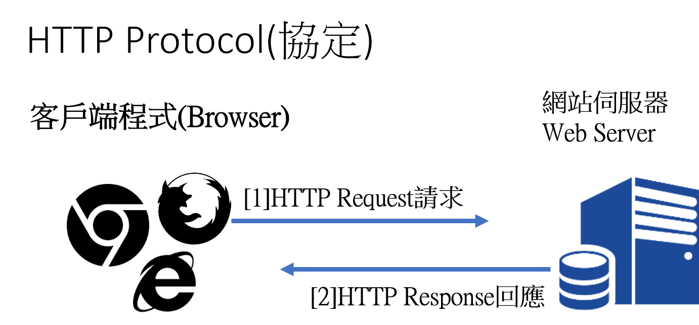
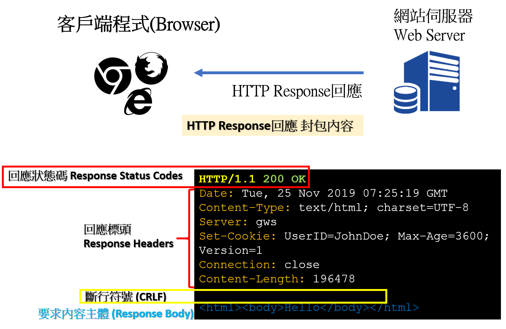

## HTTP

## HTTP Request

- CRLF refers to the special character elements "Carriage Return" and "Line Feed." 
- These elements are embedded in HTTP headers and other software code to signify an End of Line (EOL) marker. 
- Many internet protocols, including MIME (e-mail), NNTP (newsgroups) and, more importantly, HTTP, use CRLF sequences to split text streams into discrete elements. 
- Web application developers split HTTP and other headers based on where CRLF is located. 
- CRLF injection attack ==> Exploits occur when an attacker is able to inject a CRLF sequence into an HTTP stream. 

## HTTP Response

## 使用curl測試HTTP協定

## 使用測試HTTP協定
